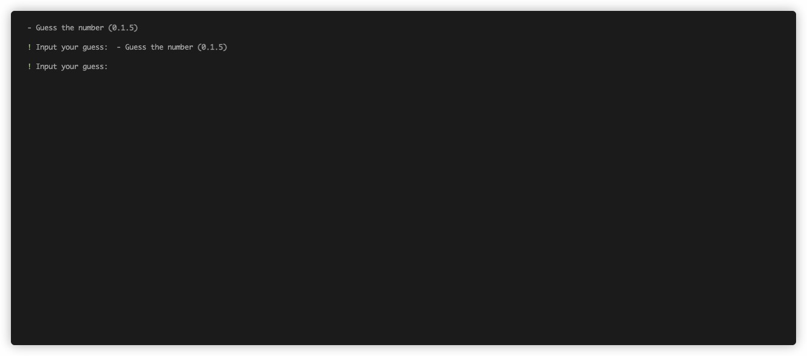

<h1 style="color: white">🎲 Guess the number</h1>
<p>A game for guessing a number written in <strong>Rust</strong>.</p>



## 💡 How it works
In case you don't know. Guess a number, and the computer says if your guess is too high, too low, or correct. Keep guessing until you find the right number. The goal is to get it in as few tries as possible.

## 📋 Features
- Exporting results.
- A bit colorful output.

## 💾 Installation
You'll need to install [rustup](https://rust-lang.org) first, then install the tool globally. Follow the steps below to set up and build the project.
```bash
# Open a terminal (Command Prompt or PowerShell for Windows, Terminal for macOS or Linux)

curl --proto '=https' --tlsv1.2 -sSf https://sh.rustup.rs | sh
```
```bash
# Ensure Git is installed
# Visit https://git-scm.com to download and install console Git if not already installed

# Clone the repository
git clone https://github.com/gregsyu/guess-number-game.git guess_number

# Navigate to the project directory
cd guess_number

# Compile the game
cargo build --release

# Move the game to your /usr/local/bin, or just /bin
mv ./target/release/guess_number /usr/local/bin
```

## ⚡️ Usage
```bash
guess_number [OPTIONS]
```
#### Example:
```bash
guess_number            # Start a new game
guess_number results    # Show game results
```

## ⌨️ Commands
```
quit                    Exit the game
save                    Save current progress
results                 View game results
name                    Change player name
restart                 Start a new game
number                  Reveal the secret number (requires password)
```

## 📌 Code Credits
The code is inspired from chapter 2 of The $Rust$ Programming Language ([online version](https://doc.rust-lang.org/book/title-page.html) available).